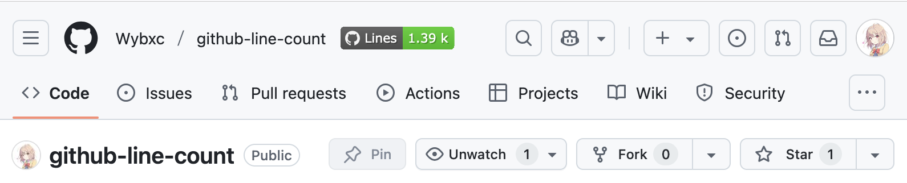

# GitHub Line Count

A browser script that adds a total line count badge to GitHub repositories.

## Features

- Displays total lines of code directly on repository pages
- Works with both public and private repositories
- Lightweight and non-intrusive

## Installation

1. Install a userscript manager like [Tampermonkey](https://www.tampermonkey.net/)
2. [Install the script](https://update.greasyfork.org/scripts/532605/GitHub%20Line%20Count.user.js)
3. (Optional) Open the menu of the userscript manager and configure a [GitHub Personal Access Token](https://docs.github.com/en/authentication/keeping-your-account-and-data-secure/managing-your-personal-access-tokens) for higher rate limits:
   - Requires `public_repo` scope for public repositories
   - Requires `repo` scope for private repositories
   - For fine-grained personal access tokens, select "Public repositories" or "All repositories" under "Repository access" as needed

## How It Works

Since GitHub does not provide a direct API to get the total line count of a repository, the script calculates approximate line counts by combining:

1. GitHub's [file tree metadata](https://gist.github.com/MichaelCurrin/6777b91e6374cdb5662b64b8249070ea)
2. [Weekly commit activity statistics](https://docs.github.com/en/rest/metrics/statistics?apiVersion=2022-11-28#get-the-weekly-commit-activity)

Note:

- Results may vary slightly from exact counts
- Very large repositories may not be supported

## Roadmap

- [ ] Add support for linguistic detection (i.e., ignore vendored or generated code)
- [ ] Add support for mobile device views

## Credits

- [gloc](https://github.com/kas-elvirov/gloc): The inspiration for this script
- [badgen](https://github.com/badgen/badgen): A tool for generating badges
